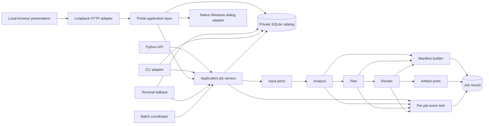

# Target architecture

Status: **accepted target architecture; compatibility, weighted, catalog, and GUI-first operator slices implemented**

This document defines the intended boundaries of the private workbench. The
current implementation includes an audited Matchering compatibility adapter,
an experimental weighted native parity pipeline, and a catalog-backed console
fallback plus a GUI-first localhost portal; it does not yet expose every target stage as a public replayable
contract. Consult the
[implementation status register](../status/implementation-status.md) before
using an interface.

For Windows distribution, a console-free desktop entrypoint packages the same
portal and DSP runtime in one EXE. Mutable state defaults to the current user's
`%LOCALAPPDATA%\MusicMasteringTools\workspace`, with one-instance locking per
workspace. The EXE location and temporary extraction folder are read-only
runtime resources, not catalog/output destinations. See
[ADR-0007](../adr/0007-windows-executable-and-user-workspace.md).

Normal desktop launches associate process lifetime with authenticated browser
tab presence. Last-tab departure requests exit after a refresh grace period and
completion of active work; another/returned tab retains the process. Persistent
source/developer modes opt out. Catalogs and preferences remain durable across
exit. See the [lifetime design](../design/browser-session-lifecycle-2026-10.md).

## Architectural drivers

- Preserve and characterize the useful Matchering 2.0.6 DSP behavior.
- Make analysis and render decisions inspectable and replayable.
- Prevent UI, queue, filesystem, and logging concerns from entering DSP code.
- Make one-reference/many-target and one-target/many-reference workflows cheap
  and safe; the current first slice is a serialized 1–32-target expansion over
  one shared 1–32-reference request.
- Preserve content identities, selections, named reference sets, and complete
  cross-run artifact visibility without copying or deleting source audio.
- Produce enough evidence to diagnose failure without manual log reconstruction.
- Bound unsafe amplification, resource use, and artifact writes.
- Keep the core offline, testable, and usable from Python without a service.

The core decision is recorded in
[ADR-0003](../adr/0003-analysis-plan-render.md).

## System context



Arrows represent dependency direction. Core stages depend on domain contracts,
not on the command line, web framework, queue, database, or concrete logger.

## Stage contracts

### 1. Ingest and canonicalize

Adapters decode a file or validate an in-memory buffer. Canonicalization
produces:

- finite floating-point samples;
- explicit channel layout and shape;
- source and canonical sample rates;
- duration/sample count;
- content identity and safe source label;
- decoder/container/subtype metadata; and
- warnings or policy decisions such as mono duplication or resampling.

The canonical audio buffer can remain in memory or be backed by an internal
storage abstraction. Its representation is not part of the serialized public
schema.

### 2. Analyze

`analyze` consumes canonical audio and an `AnalysisConfig`; it does not write
mastered output. It returns an immutable `AudioAnalysis` for targets or a
reusable `ReferenceProfile` for references.

The initial parity analyzer records:

- loud-section selection parameters and selected-region summary;
- Mid and Side loud-section RMS;
- average Mid/Side spectra needed for plan construction;
- sample-peak, RMS, duration, rate, and channel facts;
- clipping/limiting heuristics inherited from upstream, explicitly labeled as
  heuristics; and
- warnings and analysis-stage timings.

A serialized profile has `schema_version`, `algorithm_version`, input content
hash, and analysis-config hash. These are part of cache identity.

### 3. Plan

`build_plan` consumes target analysis, one or more reference profiles, and a
`PlanningConfig`. It returns an immutable `MatchPlan`. It must not need source
paths or mutate audio.

The plan is the complete render recipe:

- source/profile identities and normalized reference weights;
- internal/output sample-rate assumptions;
- initial and corrective gains;
- Mid and Side FIR coefficients or content-addressed filter artifacts;
- limiter/normalization/output-mode decisions;
- sample-peak or true-peak method, dither, metadata, and optional external-stage
  policy;
- match amount and interpolation rule;
- spectral/gain/filter guardrails and any clamps applied;
- preview selection policy;
- algorithm and schema versions; and
- warnings that the operator should review.

If any render-affecting value is absent from the plan, replay is not reliable.
Secrets, raw audio, and environment-specific absolute paths do not belong in
the plan.

The current native weighted slice records an immutable engine-result detail
tree and deterministic plan hash rather than a standalone importable
`MatchPlan`. It combines independently normalized level and frequency profiles
in logarithmic amplitude space, coalesces duplicate SHA-256 content, and sorts
effective profiles by content identity. ADR-0005 defines those implemented
semantics; the public plan boundary above remains the target.

### 4. Render

`render` consumes canonical target audio, a compatible plan, output requests,
and an injected event sink. It:

1. validates plan compatibility and guardrails;
2. applies planned Mid/Side filters and gains;
3. performs bounded RMS correction if specified;
4. branches into raw float, normalized, and limited variants as requested;
5. computes post-render measurements;
6. creates paired previews from one selected region; and
7. hands buffers and metadata to transactional artifact writers.

Render never re-analyzes a reference or consults global mutable configuration.
It returns `RenderResult`, which inventories artifact records and measurements;
it does not merely return `None`.

## Domain model

Names are conceptual until their current status is confirmed in the
[register](../status/implementation-status.md).

| Model | Purpose | Serialization |
|---|---|---|
| `SourceIdentity` | Safe label, content hash, decoded format facts | Required |
| `CanonicalAudio` | Validated samples plus canonical metadata | In-memory/internal |
| `AnalysisConfig` | Analysis-affecting controls | Required |
| `AudioAnalysis` | Measurements and target features | Required |
| `ReferenceProfile` | Reusable reference features | Required |
| `PlanningConfig` | Match policy, weights, amount, guardrails | Required |
| `MatchPlan` | Complete versioned render recipe | Required |
| `OutputRequest` | Container, subtype, mode, destination policy | Required |
| `ArtifactRecord` | Identity, path/locator, hash, size, audio facts | Required |
| `JobManifest` | Authoritative job provenance and outcome | Required |
| `JobEvent` | One structured lifecycle/diagnostic observation | Required |
| `RenderResult` | Terminal state, artifacts, measurements, warnings | Required |

All serialized models use explicit schema versions and reject unknown required
fields/semantics rather than guessing. Floating-point arrays need a canonical
encoding and hash rule before cross-process plan replay is declared verified.

## Configuration layers

Configuration is separated to make cache and replay semantics clear:

- `IngestConfig`: accepted formats, limits, channel policy, rate policy.
- `AnalysisConfig`: internal rate, FFT, piece selection, smoothing, measurement
  options.
- `PlanningConfig`: weights, match amount, guardrails, correction policy.
- `RenderConfig`: limiter/peak method, output modes, dither, metadata, preview
  behavior, and any approved external post-render stage.
- `JobPolicy`: roots, overwrite behavior, retention, cancellation, concurrency,
  event verbosity.

Every model is typed, immutable after validation, and serializable. Validation
raises stable domain errors; it never relies on Python `assert`.

The inherited settings are mapped in the
[baseline configuration table](../baseline/upstream-2.0.6.md#configuration-surface).
Moving a setting between layers is allowed, but silently dropping it is not.

## Ports and adapters

### Input ports

- `FileAudioSource`: local file decoding with allowed-root and resource policy.
- `ArrayAudioSource`: NumPy-compatible samples plus explicit sample rate and
  channel semantics.
- Future adapters may use object storage or uploads, but must yield the same
  canonical boundary.

FFmpeg fallback is an adapter concern. Invocation uses an argument list, an
isolated temporary destination, time/resource limits, captured diagnostics,
and capability detection.

An external limiter is also an adapter, never arbitrary shell execution inside
DSP. A serialized job may select only an administrator-approved executable and
argument template. Its raw input and processed output are separate artifacts
with independent measurements and a transactional commit.

### Artifact ports

- `FileArtifactStore`: atomic write-then-rename under an allowed root.
- `MemoryArtifactStore`: test and embedding use.
- Future object stores implement the same commit/abort contract.

Writers report content hash, byte count, container, subtype, sample rate,
channels, duration, and role. Output-name collision policy is explicit:
`fail`, `version`, or `replace`; `replace` is never the implicit default.

### Application adapters

- Python facade: explicit stages plus a convenience job call.
- CLI: configuration and job submission; human or JSON result rendering.
- Private content-addressed catalog: tracks/locations, named weighted sets,
  strict catalog/selection exchange, runs, and artifacts.
- GUI-first local portal: three primary workspaces—Master, Library, and
  Activity—with a unified 1–32-target/1–32-reference composer, searchable
  multi-select catalog pickers, a client-side readiness projection,
  progressive disclosure for optional settings, persistent/per-job output
  destination, source/version management, verified batch-copy export,
  recoverable master-version quarantine/restore, serialized background
  operations, History/Event log/System inspection, direct A/B candidate
  selection and swap, and native Windows file/folder dialogs.
- Interactive console workbench: explicit terminal fallback for catalog
  selection, dry run, render choices, and run/artifact inspection.
- Batch coordinator: serialized expansion and aggregate outcomes are
  implemented in the portal; reusable analysis, bounded concurrency, and
  alternative-comparison expansion remain target behavior.
- Private service adapter: submit/status/cancel/artifact contracts.

Adapters translate errors but preserve domain codes and job IDs.

### Implemented local portal layers

The GUI is intentionally split so browser concerns do not enter mastering code:

```text
packaged HTML/CSS/JavaScript (no Electron or external frontend assets)
  → Master: source selection + delivery + readiness + validate/run
  → Library: source/version lifecycle + comparison + export
  → Activity: History + Event log + System utilities
  → localhost HTTP/JSON adapter (`portal.py`)
    → GUI-independent application service (`portal_app.py`)
      → catalog/config/validation/mastering/event/manifest APIs

native browser audio element
  → media-path-scoped cookie + `/media/tracks/<catalog-id>` Range request
    → current preferred catalog location only

source-centered Library
  → completed run selection target + exact `mastered-output` artifacts
    → one original row with zero or more version/deliverable children
      → direct A/B candidate, exclusive copy export, or recoverable lifecycle

persistent comparison dock
  → direct A/B picker + assignment swap with preserved playhead
    → one browser audio element + non-destructive Quick Play preview state

native Windows picker request
  → fixed PowerShell/WinForms adapter (`native_dialogs.py`)
    → selected local paths only
```

The three-workspace model is a browser information-architecture boundary, not
a change to service authority. Reference profiles remain a Master utility;
Event log and System remain Activity utilities. The searchable batch picker
adds existing catalog identities through the same queue functions and retains
the 32-item, uniqueness, ordering, and weight rules. Readiness is derived from
current form state and active-task state; server validation remains
authoritative. A/B choices are assembled from original catalog tracks and every
playable mastered deliverable. Swap exchanges assignments without reloading the
audio element, while Quick Play occupies separate preview state and does not
mutate either assignment.

Packaged-asset contracts assert semantic workspace navigation, unique control
IDs, progressive disclosures, readiness/A-B behavior hooks, accessible names,
and responsive/focus/motion/contrast CSS. The Chromium smoke accepts explicit
workspace and viewport inputs and waits for the initialized body sentinel
before capturing evidence.

The HTTP server binds only to `127.0.0.1`. Port `0` selects an available port
for each normal launch. A fresh high-entropy token authorizes the initial page
and every API request. The page removes the launch token from its visible URL;
a different per-process `HttpOnly`, `SameSite=Strict` page cookie permits
authenticated index refresh and restores the API bootstrap token. Its name
includes the port to avoid collisions; only the index route accepts it
directly, and API requests still require the private header. Because a native
browser audio element cannot attach the
API header, the authorized page also receives a different random `HttpOnly`,
`SameSite=Strict` cookie scoped only to `/media/tracks/`. That route accepts
only a catalog identifier, resolves only its preferred location, checks regular
file/size/modification-time facts, and streams bounded chunks with single
HTTP-byte-range support; it cannot authorize APIs or serve an arbitrary path.
The handler additionally validates loopback client, Host, and same-origin
Origin/Referer values, refuses CORS preflight, limits strict JSON bodies to
1 MiB, and emits no-store, CSP, frame, MIME, permissions, and referrer headers.
Static assets are packaged locally; there is no CDN, telemetry, metadata
lookup, transcoder, or audio-upload route.

Normal startup output and the portal log contain the origin, not the
token-bearing URL. The root launcher closes its diagnostic transcript before
portal handoff; `--no-browser` or browser-open failure may then show the
private URL only in the live console. HTTP request logging replaces all three
session secrets with `[REDACTED]` and strips query values.

The token is a single-desktop-session capability, not a public identity system.
There is no TLS, account model, tenant isolation, public rate limiting, or
permission boundary against another process running as the same desktop user.
The adapter must not be rebound, proxied, tunneled, or container-published.

The browser requests native paths, then the server fingerprints/reads those
files in place. Static PowerShell scripts receive values as environment data;
no path becomes executable script text. Explorer integration selects a file or
folder without executing it.

The Activity workspace's **System** utility calls a path-confined application
API for **Session logs**. It lists only `.log` files under the workspace log
directory and returns at most the newest 256 KiB of a selected log using a
bounded tail seek. This is a local diagnostic projection, not a remote log
service; it may expose private paths and exception detail to the desktop
operator.

## Implemented catalog and audit boundary

The local SQLite catalog is a mutable cross-run index; the run manifest remains
the immutable authority for one execution. Track identity is the full file
SHA-256, while normalized paths are separate location records. The catalog
therefore coalesces byte-identical aliases, detects replacement in place,
retains missing/moved history, and relinks only verified identical content.

A catalog-backed job has three related records:

1. the versioned job configuration;
2. a strict content-bound selection containing the target, ordered references,
   paths/hashes, and independent weights; and
3. the committed run manifest, extended with catalog/selection provenance and
   indexed together with every fingerprinted input/output/audit artifact.

A multi-target portal request is an application-level aggregate, not one
multi-input DSP job. It expands to one complete three-record set per target,
using the same ordered weighted reference request. Every target receives a
distinct run ID and an exclusively created
`<target>-master-<run-id>/` folder under the selected delivery root. The
aggregate result records per-target states/counts and an explicit
continue-independent-targets policy; individual manifests remain authoritative.

The Library workspace is a read model over the same authorities, not a second
artifact store. A top-level original is any non-generated target/reference
content identity. A master version requires a completed run whose persisted
selection target matches that original and whose catalog artifact has the
exact manifest role `mastered-output`, an audio media type, and a linked
generated track. This deliberately excludes failed/dry runs, target/result
previews, retained partial output, configuration, logs, and other audit
artifacts. Version identity is the source/run/artifact lineage, not only the
content-derived track ID, because byte-identical outputs may occur in several
runs.

Batch export copies selected version artifacts to an operator-selected folder
with exclusive creation and post-copy fingerprint verification; it never
renames or mutates the audited output. Recoverable discard is similarly
version-scoped: after ownership and fingerprint checks, all mastered
deliverables for one run move to a private quarantine, their catalog pointers
transition state/path, and an indexed tombstone records the inverse operation.
Restore verifies those bytes and refuses an occupied original destination.
Source/reference audio and immutable run evidence never participate in the
move.

The delivery root comes from a per-job absolute-path request or the strict
versioned portal preference stored atomically under the private workspace.
The selected root may live outside that workspace; no existing per-target
subfolder is reused or overwritten.

Complete-catalog and selection JSON imports are strict and transactional.
Source audio is referenced in place and no catalog operation deletes it.
Archive/restore changes selection visibility while retaining history. ADR-0006
and the [operator guide](../user/workbench-and-catalog.md) define recovery and
privacy behavior.

## Job lifecycle

The terminal state machine is:

```text
accepted
  → analyzing
  → planning
  → rendering
  → committing
  → succeeded

Any non-terminal state → failed
Any cancellable state  → cancelled
```

Stages emit start and exactly one terminal event. A job reaches `succeeded` only
after all required artifacts and the terminal manifest are committed. Optional
artifact failure may produce `succeeded_with_warnings` only if the job request
declared that artifact optional; otherwise the job fails.

## Manifest design

The manifest is the durable truth for a job; logs are a diagnostic stream. The
initial `job-manifest` schema must include:

```json
{
  "schema_version": "1.0",
  "job": {
    "id": "opaque-id",
    "state": "succeeded",
    "created_at": "RFC-3339 timestamp",
    "completed_at": "RFC-3339 timestamp"
  },
  "software": {
    "application_version": "version-or-commit",
    "algorithm_version": "version",
    "python": "version",
    "dependencies": {}
  },
  "inputs": [],
  "configuration": {},
  "analysis": {},
  "plan": {},
  "stages": [],
  "artifacts": [],
  "warnings": [],
  "error": null
}
```

Normative schema files, once introduced, supersede this illustrative shape.
Required properties include:

- hashes over input content and effective configuration;
- units and methods on measurements;
- input roles without raw audio or absolute-path disclosure;
- stage start/end/duration and terminal outcome;
- algorithm/schema/dependency identity;
- output artifact hashes and audio metadata;
- guardrail interventions;
- stable warning/error codes and cause chain; and
- explicit retention policy and redaction mode.

Writing the terminal manifest is transactional. A minimal recovery manifest may
be written early and updated atomically so accepted jobs leave diagnostic
evidence after failure.

## Reference cache

A cache entry is immutable and addressed by:

```text
hash(
  reference_content_hash
  + canonicalization_identity
  + analysis_config_hash
  + algorithm_version
  + profile_schema_version
)
```

Cache metadata includes creation time, safe label, size, verification status,
and optional expiration. A cache hit still validates the entry hash and schema.
Changing weights or match amount does not invalidate reference analysis;
changing analysis parameters does.

## Concurrency and cancellation

Current portal behavior:

- one `ThreadPoolExecutor` worker serializes dry runs and renders;
- a concurrent submission fails busy instead of silently queuing;
- one request may contain 1–32 distinct targets; they run sequentially in
  request order and each owns its run/evidence/output namespace;
- target failure is recorded and later independent targets continue, with
  aggregate `succeeded`, `partial_failure`, or `failed` status;
- the reference request is immutable across targets, but analyzed profiles are
  not yet cached/reused between those target runs;
- operation status/events are projected in memory while durable job JSON,
  per-target selection, JSONL events, and manifest remain on disk;
- browser close/refresh does not affect a running worker;
- shutdown is refused while mastering is active; and
- cooperative cancellation is not implemented or claimed.

The remaining target architecture is:

- Job state, configuration, manifests, and event sinks are per-job objects.
- Shared caches and artifact stores expose explicit concurrency semantics.
- Core algorithms periodically check an injected cancellation token at
  bounded stage or chunk boundaries.
- Planning is cheap and cancellable before render allocation.
- Reference profiles are safely reusable, and batch concurrency is limited by
  a memory estimator rather than CPU count alone.
- A cancelled job cannot publish a final audio filename, but retains a
  privacy-safe terminal manifest according to retention policy.

## Determinism and compatibility

Plans record enough environment identity to distinguish:

- exact replay: same supported platform/dependency lock, byte-level output
  where proven;
- numerical replay: metric/sample differences within versioned tolerances; and
- migration: a plan transformed by an explicit, tested schema migrator.

Unknown major schema versions fail closed. Algorithm changes increment an
algorithm version even if the API schema remains stable.

## Dependency rules

The domain and application layers may depend inward only:

```text
adapters → application → domain/DSP
```

Domain/DSP must not import:

- CLI or web frameworks;
- queue/database clients;
- concrete file paths or environment variables;
- process-global log handlers; or
- network clients.

Dependency-inversion exceptions require an ADR.

## Planned package shape

The exact names may evolve, but responsibilities should remain:

```text
src/<package>/
  domain/          # versioned models, validation, errors
  dsp/             # measurements, filters, limiter, canonical transforms
  application/     # analyze/plan/render and job orchestration
  ports/           # source, artifact, event, cache contracts
  adapters/
    files/
    cli/
    service/
  schemas/         # manifest, plan, event, report schemas
```

The extracted upstream tree remains evidence until parity migration is
complete. It should not be silently rewritten in place without provenance and
characterization coverage.

## Open design questions

These require focused experiments, not guesses:

- canonical binary encoding for filter arrays and cross-platform hashes;
- acceptable exact/numerical determinism tiers across NumPy/SciPy versions;
- safe default bounds for spectral gain, filter energy, and RMS amplification;
- whether output-rate conversion belongs inside render or a post-render
  encoder;
- a perceptually sound interpolation rule for `match_amount`;
- which validated EBU R128 and true-peak implementation/reference corpus and
  tolerances define the P1 standards feature; and
- memory/chunking architecture for long tracks without changing convolution
  behavior.

Each resolved question should result in tests and, where it changes a durable
boundary, an ADR.
