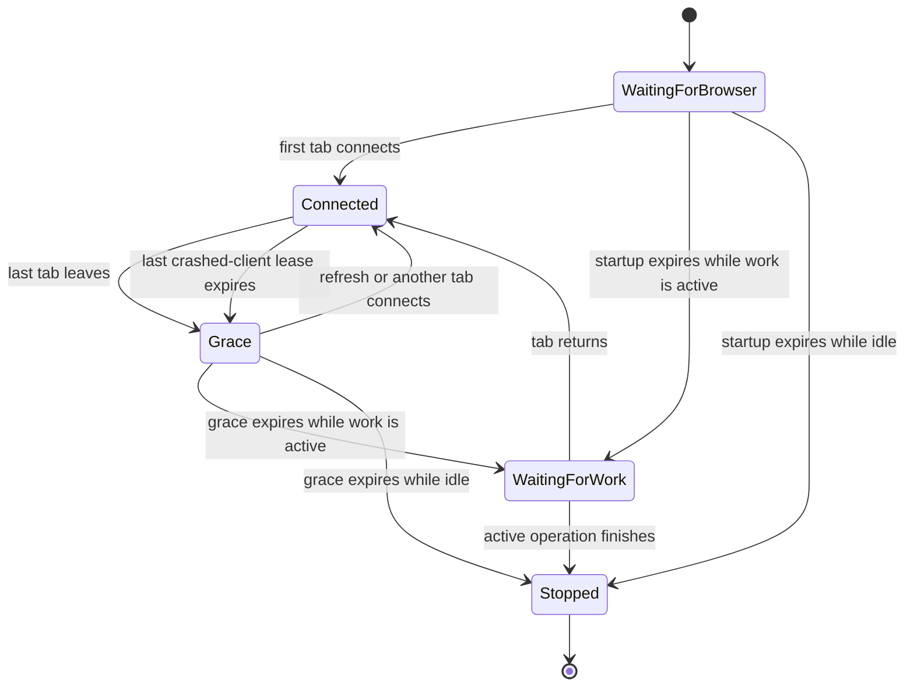

# Browser-managed desktop lifetime — October 2026

Date: **2026-10-02**. Scope: normal `MusicMasteringTools.exe` and
`python -m music_mastering_tools.desktop` launches. The source GUI/CLI,
`--keep-running`, and default `--no-browser` workflows remain persistent.

## Behavior

The browser interface is the desktop application's visible window. Closing its
last workbench tab should release the local process, workspace lock, and port
without requiring an extra shutdown command. Refresh, another workbench tab,
and an active mastering operation must retain the process.

When the last tab leaves, a four-second grace period allows refresh/reconnection.
If work is still active after that grace period, shutdown waits for the existing
operation to complete and finish its audit/catalog publication. This is an exit
request, not cancellation. A returning tab restores the live session. Manual
**Shut down portal** still refuses active work.

Startup allows 90 seconds for the first browser connection. The normal
browser-close path is distinct from a browser crash: an unreachable tab lease
expires after 180 seconds. Both paths preserve active work before exiting.
After a serving-loop pause of at least 60 seconds, existing live visits receive
a fresh reconnect interval so Windows sleep/resume does not expire an open
workbench immediately. Explicitly closed visits keep their original exit
deadline.

## Presence protocol

The first page load authenticates with the private launch URL. The interface
removes that URL's token from browser history. Refresh then uses a separate
per-process `HttpOnly`, `SameSite=Strict` page cookie, with a port-qualified
name to avoid collisions between simultaneous workspace servers. Only the
index route accepts that cookie directly; its authenticated response restores
the bootstrap API token. API requests still require `X-MMT-Token`, and media
requests use their separate playback cookie. The
[security policy](../policies/security-and-privacy.md#network-and-service-adapters)
records the host/path cookie boundary and exact capability scope.

Each document visit creates a cryptographically random identifier. `pageshow`
rotates that identity, including a document restored from the browser's
back/forward cache. Authenticated `POST /api/browser-session` requests register,
renew, or release it, and `POST /api/browser-session/wait` holds presence for up
to 25 seconds. The next poll normally starts when the previous one completes;
a 15-second heartbeat is a fallback after transport failure. Each tab has its
own identity, so one tab's release does not remove the others. Refused or
expired registration starts a fresh identity.

`pagehide` aborts the old polling generation and sends an authenticated
keepalive release. The server retains closed-visit tombstones so a delayed
heartbeat cannot revive that visit. Rotating the identity on `pageshow` allows
the same cached document to return without reopening its closed identity.

This avoids treating ordinary visibility changes or canceled navigation as
exit. There is no `beforeunload`/`unload` shutdown hook and no visibility-based
termination. Hidden/minimized tabs remain connected. The server uses expiry
for lost/crashed clients, since browsers cannot guarantee a final notification.

The browser references support these choices: [`pagehide`](https://developer.mozilla.org/en-US/docs/Web/API/Window/pagehide_event)
participates in actual page navigation and is compatible with the back/forward
cache, but is not guaranteed on every exit. [`Request.keepalive`](https://developer.mozilla.org/en-US/docs/Web/API/Request/keepalive)
allows the release request to continue after the page unloads. The application
therefore combines this best-effort notification with held HTTP presence and
bounded expiry. Visibility changes alone cannot represent closing the
workbench: background and minimized tabs are still usable sessions.

Desktop `--no-browser` keeps the process running without waiting for a tab.
`--keep-running` opts a normal browser launch out of automatic exit. The explicit
`--exit-with-browser` test option can enable browser-managed lifetime together
with `--no-browser` for controlled headless acceptance.

## State and diagnostics

Exit releases process/session state; the per-user catalog, preferences, picker
history, jobs, and completed masters remain persistent. No operator media is
copied or deleted by tab lifetime changes. The existing workspace lock still
prevents competing desktop processes.

Retained diagnostics explain connection/release, close grace, expired presence,
waiting for active work, returned clients, and the final shutdown reason.
Session access tokens remain redacted.

## Acceptance

Required regression/browser/frozen checks cover:

- idle last-tab close exits and releases the workspace/session;
- refresh and another open tab retain the process;
- hiding/minimizing retains the process;
- active work finishes before automatic exit, with preserved output/audit data;
- returned tabs clear a pending automatic exit;
- back/forward-cache restoration rotates identity and delayed requests cannot
  revive a closed visit;
- absent first browser/crashed client follows the bounded expiry policy; and
- persistent source, `--no-browser`, and `--keep-running` modes do not auto-exit.

The [implementation register](../status/implementation-status.md) records exact
passed evidence and build identity. This design document does not substitute
for those results or independent clean-computer acceptance.

The actual Chromium harness is `scripts/Invoke-BrowserLifecycleSmoke.ps1`.
Active-operation safety is checked separately by
`tests/test_browser_lifetime_operation.py`, which uses the real HTTP server and
operation manager with a blocked worker and durable output. Real bundled DSP
execution is covered by the frozen executable audio smoke. These exercises
prove their respective boundaries; the browser harness does not start a render.
